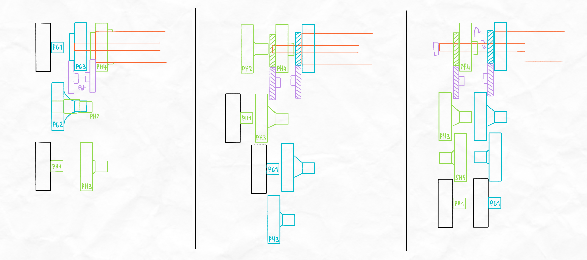
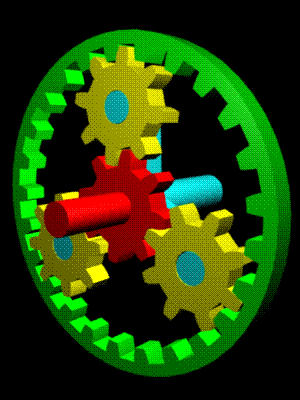

# Week 49 - December 6, 2022 - 44h

Before starting to assemble the motor with the legs we had to know if our motors are well sized for our robot.

<br>

## Motor power

To know if our motors will be powerful enough we want to know their speed and torque.

To do this we can ask these different variables :

```
N : Motor rotation speed (in rpm).

U : Electrical supply voltage of the motor

I : Current flowing through the motor

Ri : Real internal resistance of the motor

Io : No-load current

Kv : Speed constant of the motor (here we use a 320kv motor)

Pe : Electrical power of the motor

Pj : Joule effect losses

Po : Internal friction losses

Ps : Motor output power

C : Mechanical torque at motor output
```

<br>

First of all let's calculate the torque. To do this we will calculate it thanks to the power of the motor. Several characteristics apply to electric motors and brushless motors are no exception. Here are their respective formulas :

<br>

Motor speed : 
$$ \text{N = Kv} \times \text{(U - I} \times \text{Ri)} $$ 

Electrical power consumption :
$$ \text{Pe = U} \times \text{I} $$

Joule effect loss :
$$ \text{Pj = I2} \times \text{Ri} $$

Internal friction losses :
$$ \text{Po = (U - I} \times \text{Ri)} \times \text{Io} $$

<br>

We can therefore calculate the power output of the motor with the losses.

$$ \text{Ps = Pe - Pj - Po} $$

$$ \Leftrightarrow \text{Ps = U} \times \text{I - I2} \times \text{Ri - (U - I} \times \text{Ri)} \times \text{Io} $$

$$ \Leftrightarrow \text{Ps = (U - I} \times \text{Ri)} \times \text{(I - Io)} $$

We also know that the output power is :
$$ \text{Ps = N} \times \text{C} $$

<br>

We can therefore write the equality linking the torque to the electrical characteristics of the motor.

$$ \Leftrightarrow \text{N} \times \text{C = (U - I} \times \text{Ri)} \times \text{(I - Io)} $$

$$ \Leftrightarrow \text{N} \times \text{C = } \frac{N}{Kv} \times \text{(I - Io)} $$

$$ \Leftrightarrow \text{C = } \frac{(I - Io)}{Kv} $$

<br>

From the constructed information we deduced that we could estimate ``(I - Io) = 20A``.

Which gives us:

$$ \text{C = } \frac{20A}{320kv} \text{ = 0.0625 N.m}$$

<br>

Let's focus now on the speed.

We know that on a brushless motor the speed is defined by :

$$ \text{N = U} \times \text{Kv} $$

Here we intend to use 4s batteries.

$$ \text{N = (3.7V} \times \text{4)} \times \text{320Kv = 4736 rpm} $$

<br>

So we have a motor running at ``N = 4736 rpm`` for a torque of ``0.0625 N.m``.

<br>

## Required power calculation

We now need to determine the power we will need.

In the bibliographic report we estimated that the robot would be about 4kg in total. That is 1kg per leg.

When designing the legs I chose to size them in two parts of 150mm.

$$ \text{1kg} \times \text{9.81m/} s^2 \times \text{0.3m = 1.4715 N.m} $$

This means that the robot will have to support a torque of ``1.4715 N.m`` to be able to stand up when the legs are positioned as follows.


<br>

## Reducing calculation

Now we have to determine the gearbox we will need.

To do this I relied on the speed of rotation.

<br>

I estimated that our leg should move at a maximum speed of 1.5 rps. This will give us good mobility and responsiveness.

$$ \text{1.5 rps = 90 rpm} $$

$$ \frac{4736 rpm}{90 rpm} \simeq \text{52.6} $$

So I estimate that I need a gearbox of about 1/50 to fully utilize the capacity of the motors.

<br>

Knowing the torque of the motor, we can therefore estimate the torque applied to the shaft of the legs.

$$ \text{0.0625 N.m} \times \text{50 = 3.125 N.m} $$

Knowing that we needed ``1.4715 N.m``, the robot will have the power to carry more than twice its weight and thus have a significant payload.

<br>

## Reducing agent used

Several possibilities are available for the reducers.

### Buy our reducers

The first one was to buy steel ones. They will be flawless and resistant, just what we need.

Unfortunately, the ones on the market are not adapted to our motors and therefore it would have complicated our task greatly. Moreover, these reducers are often very expensive and we did not want to increase the cost of our robot unnecessarily.


We have therefore chosen to design our own gearboxes.

<br>

### Making with belts

The second solution considered was to design a system with several pulleys and belts in series.

After many tests and calculations I obtained conclusive results for different designs.



*Blue : knee transmission | Green : hip transmission | Purple : Potentiometers | Black : Motors*

But I encountered a big problem with this system. We had to use closed belts because some pulleys will make more than one full turn. And unfortunately the smallest belts on the market are 120mm. This is way too big for our system. So I had to abandon the transmission with the belts.

<br>

### Making with gears

So I turned to gears which will have allowed me to solve this problem.

The problem with the gears is that the teeth and the axles are highly solicited.

And our manufacturing means are limited so we would have to make them in 3D printing and I was afraid that it would not be strong enough in time and that our system would not have any play.

So I abandoned the idea.

<br>

### Manufacture epicyclic gears

At least not totally. After some research on the internet I discovered the existence of epicyclic gearboxes (or planetary gearboxes).



This system works with gears but the system is perfectly balanced. It is known to be more resistant, to have less play but especially, to be able to pass more torque than with simple gears.

So I chose to use this system.

<br>

## Next session

I will focus on the sizing of the gearbox and its design.