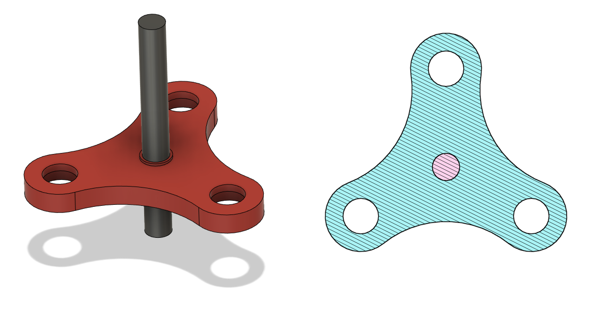
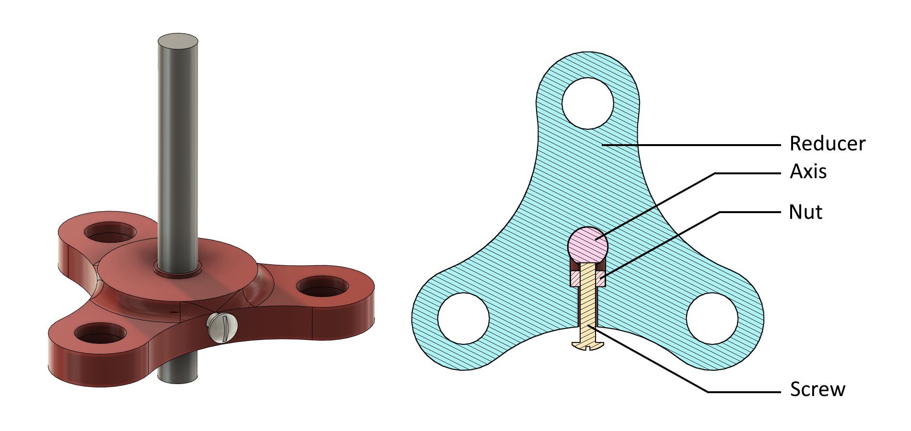

# Week 5 - January 31, 2023 - 114h

## Modification of the gearboxes

A first problem on the reducers was encountered during the first tests : the paste did not always follow the movement of the motor. It was getting out of sync with the gearbox.

And there is a simple reason, the steel shaft controlling the belt was slipping in the gearbox.

As shown on the picture, the axle was only sliding in the part that was supposed to drive the movement of the lug and so it was sliding when the system was asking for the least torque.

I changed this so that the two parts stay well linked during the movements.

I simply cut a flat on the axis and added a nut with a screw inside the part.

After retesting, this solution solved the problems of slippage and play. The system is now solid and resists high torque.

 

## Resizing of parts

The previously modified part is at the heart of the reducer. Since it has been enlarged to accommodate the life in its thickness. I had to modify all the other parts of the system so that it doesn't create an offset.

I also modified the shoulder modeled by Maximilien so that it could match the new dimensions of the reducers.

 

## Problem with the belts

We encountered a problem during the new tests. When we apply a high torque to the system the belt jumps and does not transmit the motion.

We discovered that the reason was that the belt was not tight enough. The belt is connected with screws on both ends. It was difficult to tighten it when we aimed the screws.

So I added a system on the thigh of the robot allowing to tension the belt with a screw.

The lower part of the tensioner will come against the belt and therefore will tension it. We can adjust the tension with the screw (in yellow on the schematic) then a screw passing through the hole of the blue part will lock the position of the tensioner.

The system is a first version and may need to be improved. It is possible that the friction of the tensioner with the belt due to the tension is too high. In this case it will be necessary to install a bearing.

 

## Next

We still have to add the potentiometers on the joints. Then we will be able to print the whole robot.

 