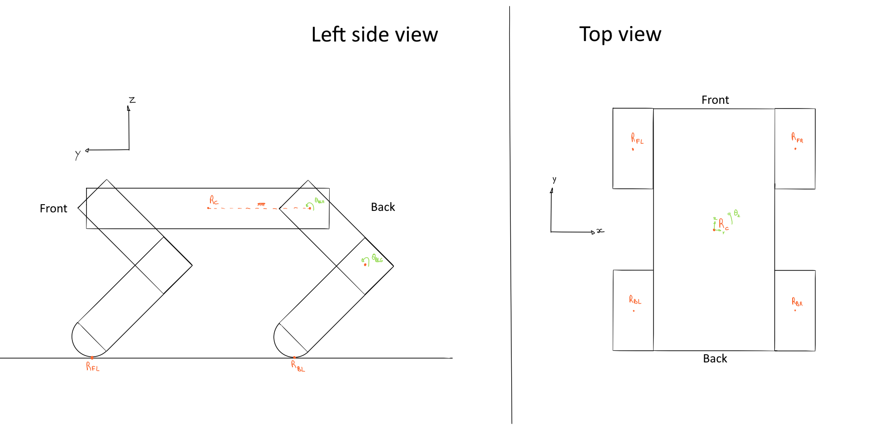
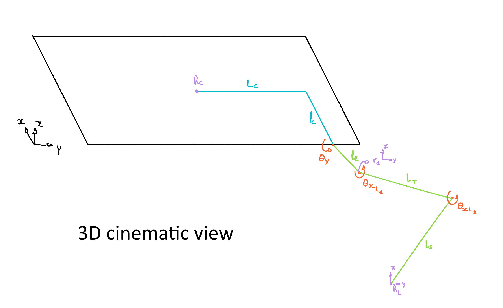
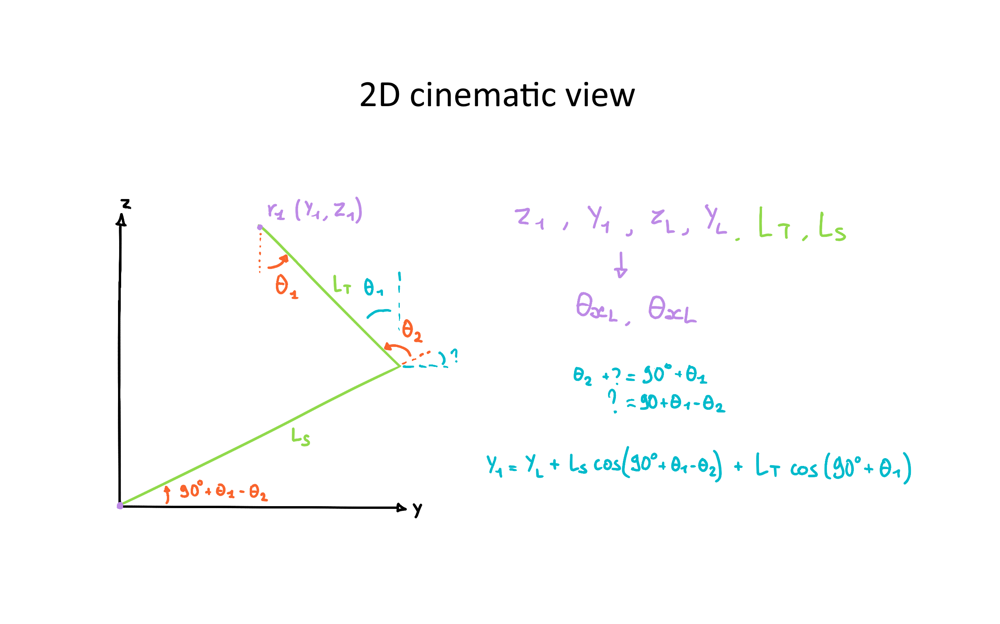

# Week 9 - February 28, 2022 - 132h

During this session I decided to start working on the math to direct the robot.

When the legs are finished, the goal is to make the robot move. Unfortunately, pre-recording movements like walking or turning is not enough. Based on this alone the robot will not be able to adapt to uneven terrain or changing loads. It must be able to find its own balance and adapt to any situation.

So I try to determine different benchmarks on the robot and the equations allowing to go from one benchmark to another.

## Definition of the benchmarks

I have defined 5 different marks on the robot.

- Rc : The reference centered in the middle of the robot, the one of the building
- Rfl : The marker at the end of the left front foot
- Rfr : The mark at the end of the right front foot
- Rbl : The marker at the end of the left rear foot
- Rbr : The mark at the end of the right rear foot

I drew plans of the robot to locate them in space. The markers are thus placed as follows:

This will allow us to determine rotations and movements in space, according to the benchmarks.

 

## Kinematic study

I have redrawn the robot in three dimensions to be able to determine the mathematical equations that will be useful to move the robot.

I defined different names of axes and rotation as shown in the diagram.

To simplify the calculations I started by studying the tibia and the thigh. So the axis of rotation of the knee and the hip. This allows us to start the calculations in 2D like the following diagram:

The goal was to move from the R1 to the RL positions. Unfortunately I did not manage to have conclusive results for the moment.

 

## Next

So I will focus on the mathematics to help find the equations to change the benchmark.